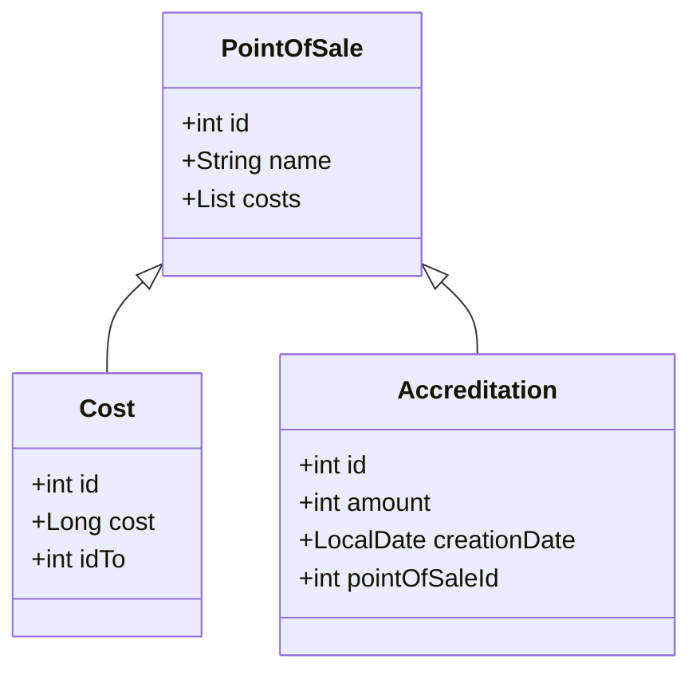

En la V2 se buscara cachear los datos en una BD redis


# Deployar proyecto:

Usar podman o docker segun corresponda
cmd:
```
podman build -f Dockerfile -t java-challenge .
```
```
podman compose up
```

# Endpoints:

**Putnos de venta:**

1
*GET*
```
/puntos-de-venta
```
Devuelve todos los puntos de venta.

2
*POST*
```
/puntos-de-venta
```
Request Param: 
- nombre: nombre del nuevo punto de venta.
Crea un nuevo punto de venta.

3
*PUT*
```
/puntos-de-venta/{id}
```
Param: id del punto de venta a modificar.

Request param: 
- nombre: nuevo nombre del punto de venta.
modifica el nombre de n punto de venta

4 
*DELETE*
```
/puntos-de-venta/{id}
```
Param: id del punto de venta.
Remueve el punto de venta.


**Costos:**

1
*POST*
```
/costo
```
Request Para:
- idA : punto de venta origen.
- idB : punto de venta destino.
- costo : costo de la ruta A B.

Carga un costo a una ruta.

2
*DELETE*
```
/costo
```
Request Para:
- idA : punto de venta origen.
- idB : punto de venta destino.

Elimina un costo a una ruta.

3
*GET*
```
/costo/rutas-directas/{id}
```
Param: id del punto de venta a que se desea conocer todas las rutas disponibles.

Devuelve todos los puntos de ventas a los que se puede acceder directamente desde el punto de venta seleccionado.

4
*GET*
```
/costo/ruta-menor-costo
```
Request Para:
- idA : punto de venta origen.
- idB : punto de venta destino.

Devuelve la ruta de menor costo entre dos puntos y su respectivo costo total.


**Acreditaciones:**

1
*POST*
```
/acreditacion
```
Request Para:
- importe : punto de venta origen.
- id : id del punto de venta a acreditar.

Persiste en al base de datos una acreditacion de un punto de venta.

2
*GET*
```
/acreditacion/{id}
```
Param: id de la acreditacion asociada a un punto de venta. 

Devuelve la informacion enriquecida de una acreditacion.